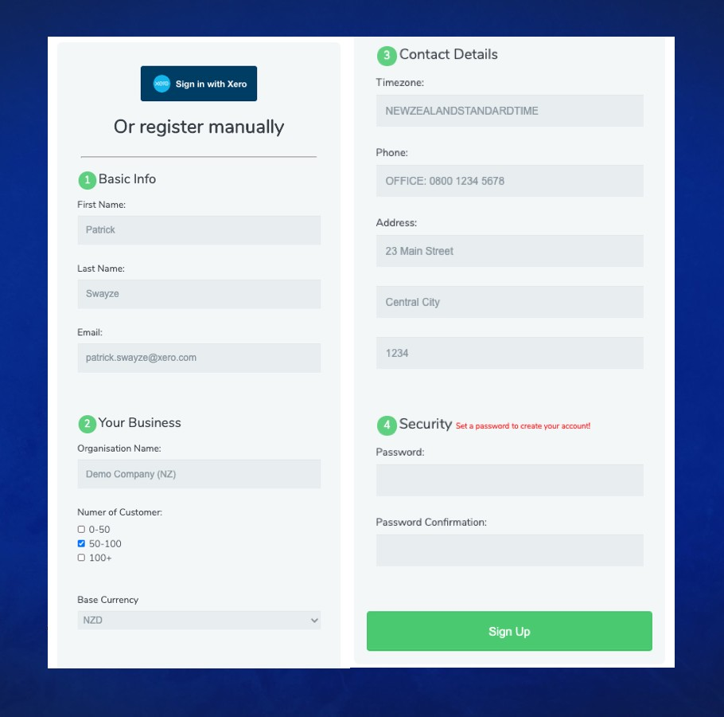

This is a basic application showing how to use the [xero-ruby](https://github.com/XeroAPI/xero-ruby) sdk and the OAuth2.0 and OpenID Connect flow to pre-populate a signup form.

# Signup with Xero

As more small business apps join Xero's marketplace we have found a huge signup conversion boost for apps create, and subsequently login with their Xero account.

Full docs on that here:
[Sign Up with Xero](https://developer.xero.com/documentation/oauth2/sign-up)
[Sign In with Xero](https://developer.xero.com/documentation/oauth2/sign-in)

> Interested in joining the Xero Partner program?
> https://developer.xero.com/partner/app-partner

However SSO does not always work with an app's infrastructure or their on-boarding process might start with booking a demo, instead of immediately starting a free-trial.

Because Xero leverages OA2 and OpenID Connect we can use the decoded `id_token` to prefill user details, and the `access_token` to make a few API calls the pre-populate dynamic signup details.



Using jsut a few lines of code, we can pre-populate the following fields from Xero's API which makes a great user experience versus dropping someone on a blank landing page.

* given_name
* family_name
* email
* org_name
* contacts_count
* currency
* timezone
* street
* city
* postal_code
* phone
* password


# Getting Started
```bash
ruby -v
ruby 2.7.0
```

https://developer.xero.com/myapps/

Clone app and rename `sample.env` to `.env` and replace with the **4 required parameters**
```bash
$ git clone git@github.com:XeroAPI/xero-ruby-oauth2-starter.git
$ cd xero-ruby-oauth2-starter/
$ mv sample.env .env
```
Replace `CLIENT_ID`, `CLIENT_SECRET` & `REDIRECT_URI` with your unique params.

```bash
$ bundle install
$ bundle exec ruby xero_app.rb
```

> Visit `http://localhost:4567/` and start exploring the code in your editor of choice 🥳

----

Checkout `xero_app.rb` for all the sample code you need to learn hwo to use the `id_token` for pre-populating a demo or signup form via.
